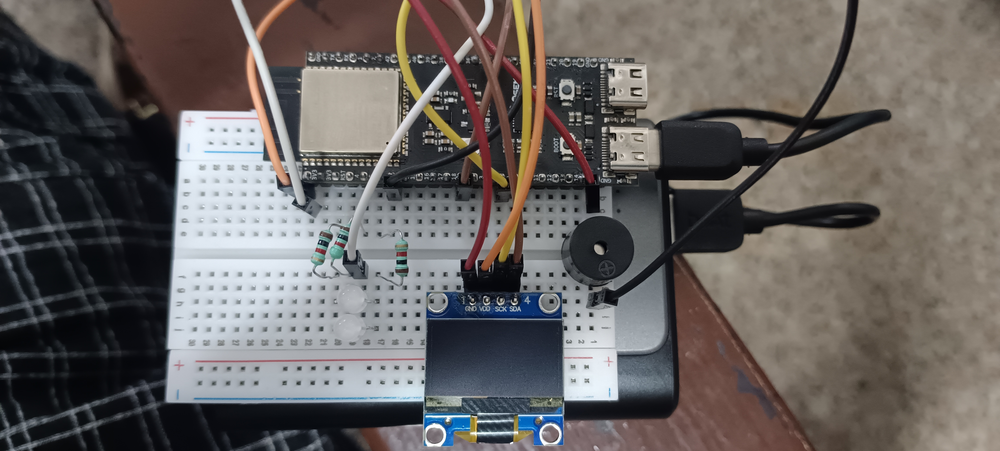

# ESP32 Electronics Project

A small ESP32-S3 electronics setup using an OLED display, passive buzzer and RGB LED.

## Hardware

- ESP32-S3 DevKitC-1
- 0.96" I2C OLED
- Passive buzzer
- 4-pin RGB LED
- 3 × 330Ω resistors
- Breadboard and jumper wires

## Wiring

### OLED

| OLED | ESP32 |
|---|---|
| GND | GND |
| VDD | 3V3 |
| SCK / SCL | GPIO9 |
| SDA | GPIO8 |

### Buzzer

| Buzzer | ESP32 |
|---|---|
| + | GPIO7 |
| - | GND |

### RGB LED

| RGB Pin | Connection |
|---|---|
| Pin 1 | 330Ω → GPIO4 |
| Pin 2 | 330Ω → GPIO5 |
| Pin 3 | 3V3 |
| Pin 4 | 330Ω → GPIO6 |

Pin 3 is connected to 3V3, so the RGB LED is wired as common-anode.
Each RGB channel uses a resistor to limit current.

## Wiring Photo



---

# Program Details

The included `.ino` sketch controls the OLED, buzzer, RGB lighting and a small phone-friendly web interface.

## Main Libraries

```cpp
#include <Arduino.h>
#include <Wire.h>
#include <Adafruit_GFX.h>
#include <Adafruit_SSD1306.h>
#include <WebServer.h>
#include <ESP32Base.h>
```

### What they do

- **Wire** — I2C communication with the OLED.
- **Adafruit_GFX** — graphics/text functions for the OLED.
- **Adafruit_SSD1306** — controls the 128×64 SSD1306 OLED.
- **WebServer** — provides the control page and HTTP endpoints.
- **ESP32Base** — shared library used by ESP32 projects for common Wi-Fi, OTA, mDNS and TCP logging functionality.

The reusable `ESP32Base` library is kept separately in the repository:

```text
libs/
└── ESP32Base/
    ├── ESP32Base.h
    ├── ESP32Base.cpp
    ├── library.properties
    └── README.md
```

See `libs/ESP32Base/README.md` for the library documentation.

## Using ESP32Base

The project starts the shared library in `setup()`:

```cpp
ESP32Base.begin();
```

and keeps it running inside `loop()`:

```cpp
ESP32Base.loop();
```

This gives the project common ESP32 services such as:

- Saved Wi-Fi connection
- Multiple saved Wi-Fi networks
- mDNS
- OTA firmware updates
- TCP terminal/logging
- ESP32 status information

The birthday/electronics application itself remains responsible for the OLED, buzzer, RGB LED and web controls.

---

# Program Structure

The sketch is divided into a few main parts:

## 1. Buzzer / Music

The melody is stored as note frequencies:

```cpp
const uint16_t melody[] = {
  262, 262, 294, 262, 349, 330,
  ...
};
```

The program calculates the duration of each note from the tempo and note division.

Important settings:

```cpp
#define TEMPO_BPM 140
#define SOUND_PCT 70
```

`TEMPO_BPM` controls the song speed.

`SOUND_PCT` makes the buzzer sound for part of each note and remain silent for the rest, which gives the melody clearer separation between notes.

The buzzer uses ESP32 LEDC hardware to generate the required frequencies.

## 2. OLED Display

The OLED is 128×64 pixels.

The program has three main screen states:

- **Ready** — birthday message and cake
- **Playing** — lyrics with the current word highlighted
- **Done** — birthday message after the song finishes

The OLED also shows a small progress bar while the song is playing.

## 3. Lyrics Synchronization

The lyrics are stored as two groups:

```cpp
const char* const lyrics[2][3] = {
  { "HAPPY", "BIRTHDAY", "TO YOU" },
  { "HAPPY", "BIRTHDAY", "DEAR HEER" }
};
```

`lyricPos[]` maps each melody note to the word that should be highlighted.

So the OLED changes the highlighted word while the melody plays.

## 4. RGB Lighting

The RGB LED is controlled using three ESP32 PWM outputs:

```text
Red   → GPIO4
Green → GPIO5
Blue  → GPIO6
```

Because the LED is common-anode, the software uses inverted PWM logic.

The program converts HSV colors into RGB values so it can smoothly change colors.

During the song:

- The RGB color follows the current lyric word.
- The brightness changes with the music.
- Higher notes receive a brightness boost.
- Each note produces a gentle pulse.

After the song, the lights enter a party/rainbow effect.

## 5. Light Brightness

The program has a global light level:

```cpp
uint8_t lightsPercent = 60;
```

This controls the overall RGB/candle brightness.

## 6. Buzzer Controls

The program has three sound-related values:

```cpp
uint8_t volumePercent = 100;
uint8_t balancePercent = 75;
#define SOUND_PCT 70
```

### Volume

Controls overall buzzer loudness.

### Note balance

Passive buzzers can sound louder on higher notes. The balance calculation reduces that difference so the melody sounds more even.

### Sound percentage

Controls how much of each note duration actually produces sound.

## 7. Web Control

The ESP32 hosts a small web page that can be opened from a phone on the same Wi-Fi network.

Available controls:

- **PLAY**
- **STOP**
- **Volume**
- **Note balance**
- **Lights**

Main HTTP endpoints:

```text
/
 /play
 /stop
 /volume?v=...
 /balance?v=...
 /lights?v=...
 /status
```

The `/status` endpoint returns the current playing state and slider values.

The web server is separate from `ESP32Base`: the shared library provides the common Wi-Fi/network foundation, while this project creates its own application web interface.

## 8. Main Program Loop

The ESP32 repeatedly runs:

```cpp
void loop() {
  ESP32Base.loop();
  server.handleClient();
  updateSong();
  updateIdleScreen();
  updateLights();
  delay(1);
}
```

`ESP32Base.loop()` keeps the shared library services such as OTA and TCP logging alive.

The remaining functions handle the project's own application logic.

---

# Pin Reference

### Hardware wiring

The physical wiring documented in this project is:

```text
OLED:
SCL → GPIO9
SDA → GPIO8

Buzzer:
+ → GPIO7

RGB:
Red   → GPIO4
Green → GPIO5
Blue  → GPIO6
```

### Important

Make sure the pin definitions in the `.ino` match the actual hardware wiring before uploading.

If the sketch contains different OLED pin definitions, update either the wiring or the definitions so they match.

---

# Shared Library

This project uses the common library:

```text
libs/ESP32Base/
```

The library is intentionally kept separate so other ESP32 projects in this repository can reuse the same Wi-Fi, OTA, mDNS and TCP logging functionality.

```text
Esp32-Projects/
├── Birthday/
├── libs/
│   └── ESP32Base/
│       ├── ESP32Base.h
│       ├── ESP32Base.cpp
│       ├── library.properties
│       └── README.md
└── README.md
```

For library-specific information, read:

```text
libs/ESP32Base/README.md
```

---

# Files

```text
ESP32_Electronics_Project/
├── README.md
├── wiring.jpg
└── Heer_Birthday_ESP32_Lyrics_Music_RGB.ino
# ESP32 Electronics Project

A small ESP32-S3 electronics setup using an OLED display, passive buzzer and RGB LED.

## Hardware

- ESP32-S3 DevKitC-1
- 0.96" I2C OLED
- Passive buzzer
- 4-pin RGB LED
- 3 × 330Ω resistors
- Breadboard and jumper wires

## Wiring

### OLED

| OLED | ESP32 |
|---|---|
| GND | GND |
| VDD | 3V3 |
| SCK / SCL | GPIO9 |
| SDA | GPIO8 |

### Buzzer

| Buzzer | ESP32 |
|---|---|
| + | GPIO7 |
| - | GND |

### RGB LED

| RGB Pin | Connection |
|---|---|
| Pin 1 | 330Ω → GPIO4 |
| Pin 2 | 330Ω → GPIO5 |
| Pin 3 | 3V3 |
| Pin 4 | 330Ω → GPIO6 |

Pin 3 is connected to 3V3, so the RGB LED is wired as common-anode.
Each RGB channel uses a resistor to limit current.

## Wiring Photo


---

# Program Details

The included `.ino` sketch controls the OLED, buzzer, RGB lighting and a small phone-friendly web interface.

## Main Libraries

```cpp
#include <Arduino.h>
#include <Wire.h>
#include <Adafruit_GFX.h>
#include <Adafruit_SSD1306.h>
#include <WebServer.h>
#include <ESP32Base.h>
```

### What they do

- **Wire** — I2C communication with the OLED.
- **Adafruit_GFX** — graphics/text functions for the OLED.
- **Adafruit_SSD1306** — controls the 128×64 SSD1306 OLED.
- **WebServer** — provides the control page and HTTP endpoints.
- **ESP32Base** — shared library used by ESP32 projects for common Wi-Fi, OTA, mDNS and TCP logging functionality.

The reusable `ESP32Base` library is kept separately in the repository:

```text
libs/
└── ESP32Base/
    ├── ESP32Base.h
    ├── ESP32Base.cpp
    ├── library.properties
    └── README.md
```

See `libs/ESP32Base/README.md` for the library documentation.

## Using ESP32Base

The project starts the shared library in `setup()`:

```cpp
ESP32Base.begin();
```

and keeps it running inside `loop()`:

```cpp
ESP32Base.loop();
```

This gives the project common ESP32 services such as:

- Saved Wi-Fi connection
- Multiple saved Wi-Fi networks
- mDNS
- OTA firmware updates
- TCP terminal/logging
- ESP32 status information

The birthday/electronics application itself remains responsible for the OLED, buzzer, RGB LED and web controls.

---

# Program Structure

The sketch is divided into a few main parts:

## 1. Buzzer / Music

The melody is stored as note frequencies:

```cpp
const uint16_t melody[] = {
  262, 262, 294, 262, 349, 330,
  ...
};
```

The program calculates the duration of each note from the tempo and note division.

Important settings:

```cpp
#define TEMPO_BPM 140
#define SOUND_PCT 70
```

`TEMPO_BPM` controls the song speed.

`SOUND_PCT` makes the buzzer sound for part of each note and remain silent for the rest, which gives the melody clearer separation between notes.

The buzzer uses ESP32 LEDC hardware to generate the required frequencies.

## 2. OLED Display

The OLED is 128×64 pixels.

The program has three main screen states:

- **Ready** — birthday message and cake
- **Playing** — lyrics with the current word highlighted
- **Done** — birthday message after the song finishes

The OLED also shows a small progress bar while the song is playing.

## 3. Lyrics Synchronization

The lyrics are stored as two groups:

```cpp
const char* const lyrics[2][3] = {
  { "HAPPY", "BIRTHDAY", "TO YOU" },
  { "HAPPY", "BIRTHDAY", "DEAR HEER" }
};
```

`lyricPos[]` maps each melody note to the word that should be highlighted.

So the OLED changes the highlighted word while the melody plays.

## 4. RGB Lighting

The RGB LED is controlled using three ESP32 PWM outputs:

```text
Red   → GPIO4
Green → GPIO5
Blue  → GPIO6
```

Because the LED is common-anode, the software uses inverted PWM logic.

The program converts HSV colors into RGB values so it can smoothly change colors.

During the song:

- The RGB color follows the current lyric word.
- The brightness changes with the music.
- Higher notes receive a brightness boost.
- Each note produces a gentle pulse.

After the song, the lights enter a party/rainbow effect.

## 5. Light Brightness

The program has a global light level:

```cpp
uint8_t lightsPercent = 60;
```

This controls the overall RGB/candle brightness.

## 6. Buzzer Controls

The program has three sound-related values:

```cpp
uint8_t volumePercent = 100;
uint8_t balancePercent = 75;
#define SOUND_PCT 70
```

### Volume

Controls overall buzzer loudness.

### Note balance

Passive buzzers can sound louder on higher notes. The balance calculation reduces that difference so the melody sounds more even.

### Sound percentage

Controls how much of each note duration actually produces sound.

## 7. Web Control

The ESP32 hosts a small web page that can be opened from a phone on the same Wi-Fi network.

Available controls:

- **PLAY**
- **STOP**
- **Volume**
- **Note balance**
- **Lights**

Main HTTP endpoints:

```text
/
 /play
 /stop
 /volume?v=...
 /balance?v=...
 /lights?v=...
 /status
```

The `/status` endpoint returns the current playing state and slider values.

The web server is separate from `ESP32Base`: the shared library provides the common Wi-Fi/network foundation, while this project creates its own application web interface.

## 8. Main Program Loop

The ESP32 repeatedly runs:

```cpp
void loop() {
  ESP32Base.loop();
  server.handleClient();
  updateSong();
  updateIdleScreen();
  updateLights();
  delay(1);
}
```

`ESP32Base.loop()` keeps the shared library services such as OTA and TCP logging alive.

The remaining functions handle the project's own application logic.

---

# Pin Reference

### Hardware wiring

The physical wiring documented in this project is:

```text
OLED:
SCL → GPIO9
SDA → GPIO8

Buzzer:
+ → GPIO7

RGB:
Red   → GPIO4
Green → GPIO5
Blue  → GPIO6
```

### Important

Make sure the pin definitions in the `.ino` match the actual hardware wiring before uploading.

If the sketch contains different OLED pin definitions, update either the wiring or the definitions so they match.

---

# Shared Library

This project uses the common library:

```text
libs/ESP32Base/
```

The library is intentionally kept separate so other ESP32 projects in this repository can reuse the same Wi-Fi, OTA, mDNS and TCP logging functionality.

```text
Esp32-Projects/
├── Birthday/
├── libs/
│   └── ESP32Base/
│       ├── ESP32Base.h
│       ├── ESP32Base.cpp
│       ├── library.properties
│       └── README.md
└── README.md
```

For library-specific information, read:

```text
libs/ESP32Base/README.md
```

---

# Files

```text
birthday/
├── README.md
├── wiring.jpg
└── code.ino
```

