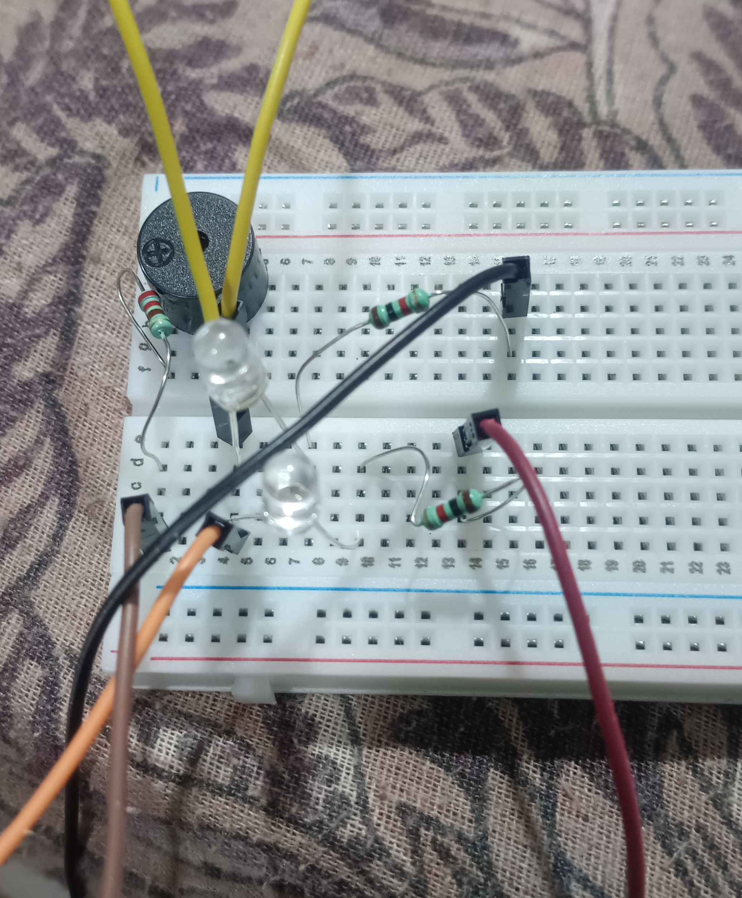

# CS15 Buzzer

A simple ESP32-S3 buzzer and LED countdown project with a phone-friendly web control page.

The project runs a **9-second countdown** using a buzzer and red/green LEDs. The countdown can be started, stopped, and adjusted from the web interface.

## Hardware

- ESP32-S3 DevKitC-1
- Buzzer
- Red LED
- Green LED
- 2 × 330Ω resistors
- Breadboard
- Jumper wires

The circuit definition uses an ESP32-S3 DevKitC-1, red/green LEDs, 330Ω resistors, and a buzzer. fileciteturn3file0L7-L34

## Wiring

| Component | ESP32 |
|---|---|
| Buzzer + | GPIO4 |
| Buzzer - | GND |
| Red LED → 330Ω resistor | GPIO16 |
| Red LED cathode | GND |
| Green LED → 330Ω resistor | GPIO17 |
| Green LED cathode | GND |

The wiring above follows the project's circuit definition. fileciteturn3file0L38-L69

### Pin Definitions

The `.ino` file uses:

```cpp
#define BUZZER_PIN 4
#define RED_PIN 16
#define GREEN_PIN 17
```

fileciteturn3file1L5-L10

## Wiring Photo



---

# How It Works

The project uses a **9-second countdown**.

```text
START
  ↓
9 → 8 → 7 seconds
Green LED ON
  ↓
6 → 5 → 4 seconds
Red / Green alternate
  ↓
3 → 2 → 1 seconds
Red / Green alternate faster
  ↓
0
Solid RED + continuous buzzer
  ↓
STOP
```

The countdown duration is defined as:

```cpp
const unsigned long BOMB_TIME = 9000;
```

fileciteturn3file1L17-L29

## Light Pattern

### 9–7 seconds

The green LED stays ON.

### 6–4 seconds

Red and green alternate every **400 ms**.

### 3–1 seconds

Red and green alternate faster, every **150 ms**.

### At 0 seconds

The red LED becomes solid and the buzzer stays continuously ON until **STOP** is pressed.

This behavior is implemented in the light and countdown logic. fileciteturn3file1L32-L71

---

# Web Control

The ESP32 starts a web server on port 80.

The web page contains:

- Countdown display
- Starting-delay slider
- START / STOP button
- Current state
- Explosion state at 0 seconds

The page is designed for use from a phone browser. fileciteturn3file1L97-L224

## Starting Delay

The slider controls the initial buzzer delay.

Range:

```text
200 ms → 1500 ms
```

Default:

```text
900 ms
```

The delay gradually becomes shorter as the countdown progresses, creating an accelerating beep effect. fileciteturn3file1L75-L92

## Web Endpoints

| Endpoint | Purpose |
|---|---|
| `/` | Opens the control page |
| `/start` | Starts the countdown |
| `/stop` | Stops and resets the countdown |
| `/delay?v=...` | Changes the starting beep delay |
| `/status` | Returns current countdown status |

These routes are registered by the project web server. fileciteturn3file1L342-L453

---

# ESP32Base Library

This project uses the shared library from the repository:

```text
libs/ESP32Base/
```

It is initialized with:

```cpp
ESP32Base.begin();
```

and kept running with:

```cpp
ESP32Base.loop();
```

The project uses it for the common ESP32 Wi-Fi and OTA functionality, while this project handles its own web server, buzzer and LEDs. fileciteturn3file1L455-L530

For complete library documentation:

```text
libs/ESP32Base/README.md
```

---

# Program Structure

The main `.ino` file is organized into:

```text
PINS
  ↓
WEB SERVER
  ↓
COUNTDOWN SETTINGS
  ↓
LIGHT CONTROL
  ↓
BEEP SPEED
  ↓
WEB PAGE
  ↓
WEB HANDLERS
  ↓
SETUP
  ↓
LOOP
```

The main loop continuously:

1. Keeps `ESP32Base` running.
2. Handles web requests.
3. Updates the red/green light pattern.
4. Calculates the buzzer interval.
5. Toggles the buzzer.
6. Keeps the buzzer continuously ON after the countdown reaches zero.

fileciteturn3file1L524-L592

## Main Files

```text
cs15_buzzer/
├── README.md
├── code.ino
├── circuit.json
└── wiring.jpg
```

### `code.ino`

Main ESP32 application containing the buzzer, LED, countdown and web-server logic.

### `circuit.json`

Circuit definition containing the ESP32, LEDs, resistors, buzzer and their connections.

### `wiring.jpg`

Photo of the physical breadboard setup.
